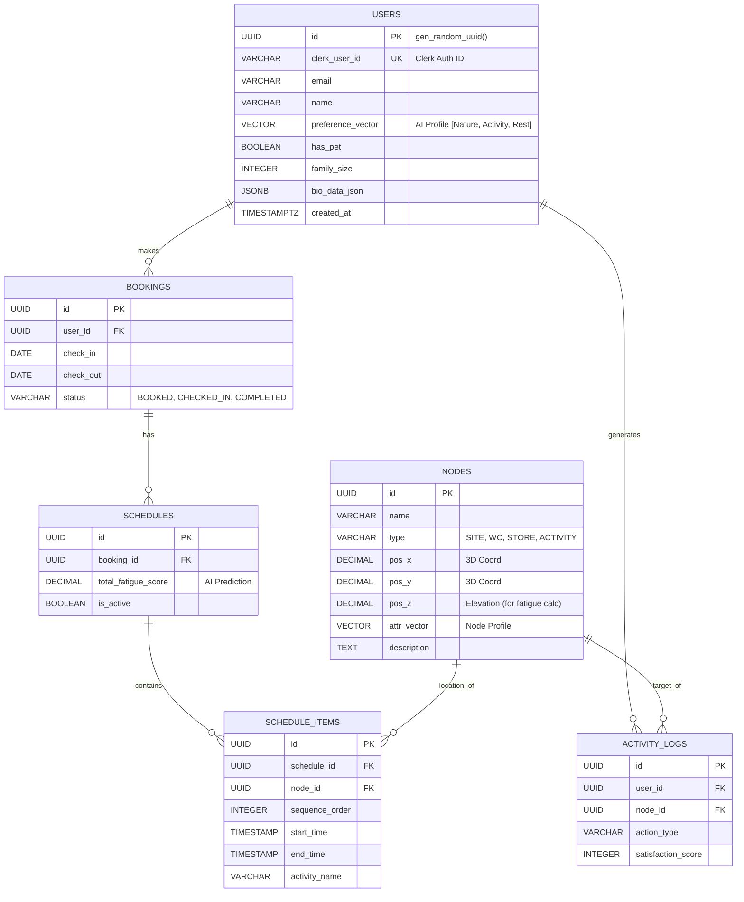

### 1. `MERMAID.md`
시스템 아키텍처, 데이터베이스 설계, 사용자 흐름을 시각화한 문서입니다.

```markdown
# CampX System Visualizations

## 1. Database Schema (ERD)
CampX uses PostgreSQL on Neon with `pgvector` for AI matching.



## 2. System Architecture
Next.js 16 Monolith with Server Actions.

```mermaid
graph TD
    Client[Client Browser]
    
    subgraph "Next.js 16 (App Router)"
        Auth[Clerk Middleware]
        UI[React Components]
        Three[R3F Canvas (3D Map)]
        Action[Server Actions]
    end
    
    subgraph "Data Layer (Neon)"
        DB[(PostgreSQL)]
        Vector[pgvector Extension]
    end
    
    Client -->|Request| Auth
    Auth -->|Verified| UI
    UI -->|Render 3D| Three
    UI -->|Data Fetch / Mutate| Action
    Action -->|SQL Query| DB
    Action -->|Vector Similarity| Vector
```

## 3. User Journey (AI Scheduling)

```mermaid
sequenceDiagram
    actor User
    participant App as Next.js App
    participant AI as AI Logic (Server Action)
    participant DB as Neon DB

    User->>App: Login (Clerk)
    App->>User: Show Survey (Condition, Companion)
    User->>App: Submit Survey Data
    
    App->>AI: Request Schedule Generation
    AI->>DB: Fetch User Vector & Node Vectors
    DB-->>AI: Return Vectors
    
    AI->>AI: Calculate Cosine Similarity
    AI->>AI: Apply Fatigue Logic (Elevation/Distance)
    AI->>DB: Save Schedule & Items
    
    App->>User: Display Timeline & 3D Map
    User->>App: Click "Start Schedule"
    App->>DB: Update Booking Status